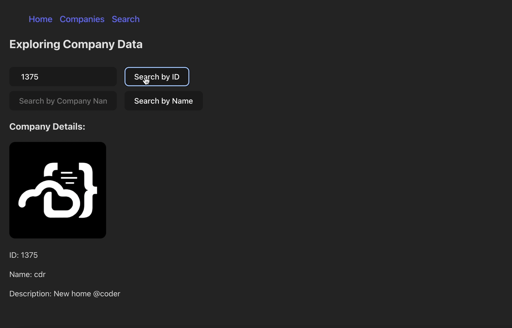

## DEMO:


# Company Portal App

Hey there! 👋 Welcome to the Company Portal App, a project I've been working on to create a streamlined portal for managing company data. This React application is crafted with Redux and TypeScript, combining powerful state management with static typing.

## Features I've Built

### Fetching Companies

I've implemented Redux actions to seamlessly fetch company data from APIs. Users can get all companies or retrieve a single company by ID.

### Redux State Management

To maintain a clear global state, the fetched data is stored in the Redux store. This includes attributes for an array of items, loading indicators, and error handling.

### Loading and Error Handling

Handling cases such as request, success, and failure is crucial. I've ensured a smooth user experience by displaying a loading state (either through a Loading component or simple text) when the app is fetching data. Additionally, I've implemented a graceful error handling mechanism to display error messages in case of API fetch errors.

### Search by Company Name

I've added a nifty feature to search for companies by their names. This makes it easy for users to quickly locate specific companies within the portal.

### Sorting Made Simple

Navigating through a list of companies is made efficient with a sorting feature. Users can easily sort the displayed companies based on their preferences.

## Getting Started

Excited to try it out? Here's how you can run the Company Portal App locally:

### Prerequisites

Make sure you have the following installed:

- [Node.js](https://nodejs.org/)
- [npm](https://www.npmjs.com/) (Node Package Manager)

### Clone and Install

```bash
git clone 
cd company-portal-app
npm install
